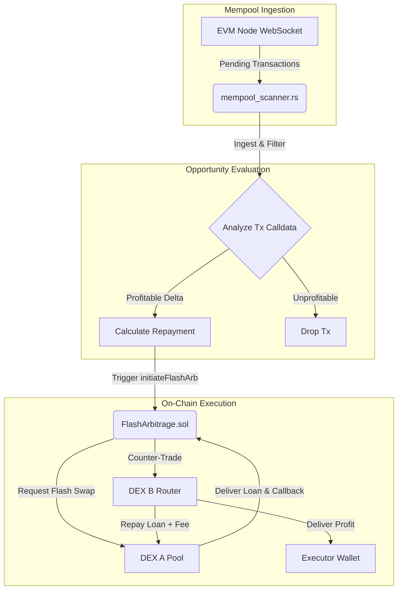

# 🌌 Aether Dynamics: Aether-MEV-Core

[](https://soliditylang.org/)
[](https://www.rust-lang.org/)
[](https://opensource.org/licenses/MIT)

An ultra-low-latency, asynchronous mempool scanner and zero-capital flash arbitrage router. **Aether-MEV-Core** is designed to capture atomic cross-exchange arbitrage opportunities on EVM-compatible blockchains by combining high-throughput mempool ingestion in Rust with execution smart contracts in Solidity.

---

## 🛠 Architecture Overview



1. **Ingestion (`mempool_scanner.rs`)**: Connects to the EVM execution client via low-latency WebSockets. Pending transaction hashes are streamed, fetched, and analyzed in parallel.
2. **Analysis**: Decodes the calldata of pending swaps to predict frontrunning, backrunning, or sandwich arbitrage opportunities.
3. **Execution (`FlashArbitrage.sol`)**: A customized smart contract that accepts flash swaps from a Uniswap V2-compatible pair, routes counter-trades through a target router, validates profitability post-execution, and safely transfers profits to the owner.

---

## 📂 Core Components

### 1. [FlashArbitrage.sol](file:///c:/Users/de3th/Downloads/Aether-MEV-Core/FlashArbitrage.sol)
A gas-optimized, security-hardened smart contract for atomic flash swap executions.
* **modifier onlyOwner**: Restricts contract execution to the owner.
* **initiateFlashArb**: Calls `swap` on the starting DEX pair, passing encoded payload to invoke the flash swap.
* **uniswapV2Call**: Receives the callback from the swap, performs the counter-trade, ensures the transaction remains profitable, repays the loan, and harvests the MEV profit.

### 2. [mempool_scanner.rs](file:///c:/Users/de3th/Downloads/Aether-MEV-Core/mempool_scanner.rs)
A Rust service built using `ethers-rs` and `tokio` for low-overhead asynchronous execution.
* Uses lightweight tokio threads to process transaction receipts concurrently without blocking the main event loop.
* Reads transaction details and evaluates routing paths to identify price differences across exchanges.

---

## 🚀 Setup & Execution

### Prerequisites
* [Rust](https://www.rust-lang.org/tools/install) (v1.70+)
* [Node.js / Hardhat / Foundry](https://hardhat.org/) (for Solidity contract deployment)

### 1. Smart Contract Deployment
Compile and deploy the contract using Hardhat or Foundry:
```bash
# Compilation
npx hardhat compile

# Deploy to network
npx hardhat run scripts/deploy.js --network <network_name>
```

### 2. Mempool Scanner Configuration
Configure your environment variables:
```bash
export WSS_RPC_URL="wss://your-ethereum-node-websocket-url"
```

Build and run the mempool scanner:
```bash
cargo build --release
cargo run --release
```

---

## ⚠️ Disclaimer
This repository is presented for educational and portfolio demonstration purposes. Running arbitrage bots on public mainnets involves high financial risks, gas wars, and competitive bidding (PGA). Use caution when deploying real capital.

## 📄 License
This project is licensed under the [MIT License](LICENSE).
